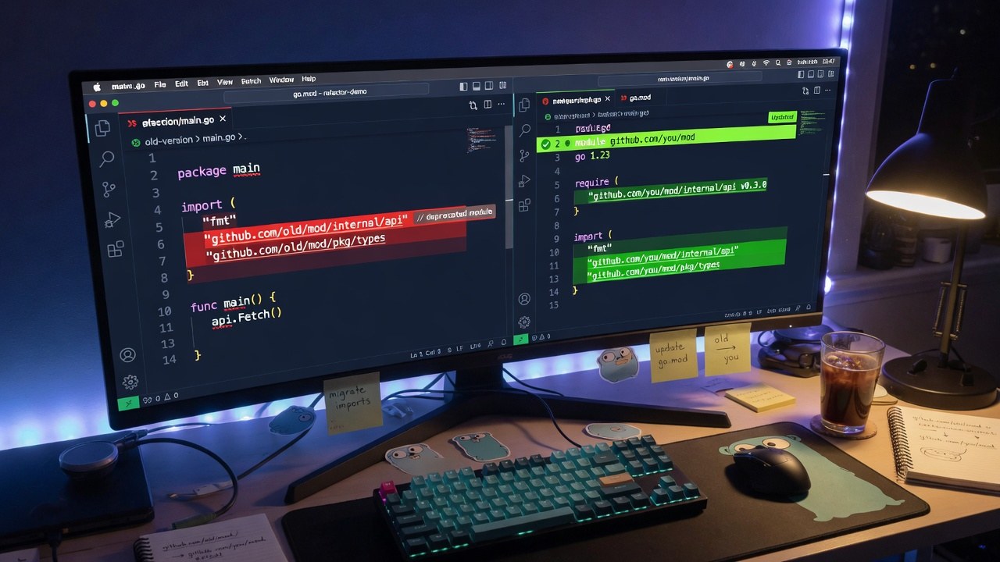

<p align="center">
  
</p>

# gomod-rename

**Rename a Go module without hunting import paths by hand.**

`go.mod` and every `import` that still says the old path. Dry-run
unless you pass `-w`. Skips `vendor/` and hidden directories. Stdlib
only.

```bash
# see the hits
gomod-rename github.com/old/mod github.com/you/mod

# write them
gomod-rename -w github.com/old/mod github.com/you/mod
```

```
go.mod                          module github.com/old/mod
internal/api/client.go          "github.com/old/mod/internal/api"
```

becomes

```
go.mod                          module github.com/you/mod
internal/api/client.go          "github.com/you/mod/internal/api"
```

## Install

Needs Go 1.23+.

```bash
go install github.com/lancekrogers/gomod-rename/cmd/gomod-rename@latest
```

## Usage

```bash
gomod-rename github.com/old/module github.com/new/module
gomod-rename -w github.com/old/module github.com/new/module
gomod-rename -w -y github.com/old/module github.com/new/module
gomod-rename -d ./myproject -w github.com/old/module github.com/new/module
gomod-rename -v github.com/old/module github.com/new/module
```

| Flag | Short | |
|------|-------|--|
| `--write` | `-w` | Apply. Default is a preview. |
| `--dir` | `-d` | Search root (default `.`) |
| `--yes` | `-y` | No confirm prompt |
| `--verbose` | `-v` | Every match |
| `--version` | | Version |

## Build / test

```bash
just build
just test
just check
```

Or `go build -o bin/gomod-rename ./cmd/gomod-rename`.

## License

[MIT](LICENSE)
